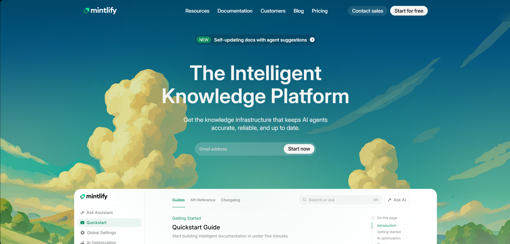

# Mintlify Landing Page Clone

This project is a desktop-first recreation of the [Mintlify](https://mintlify.com/) documentation platform's landing page. It was built using pure HTML and CSS as part of a Web Development Cohort Peer Project Assingment by [Chai Code](https://www.chaicode.com/)

## 🚀 Live Demo

[Live Demo](https://jeffranjan.github.io/Mintlify-Peer-Project/)

## 📸 Screenshots



## 🛠️ Technologies Used

- **HTML5**: Semantic tags for structuring web content.
- **CSS3**: Vanilla CSS for styling, flexbox/grid for layouts, and custom variables for theming.
- No JavaScript, TailwindCSS, or other frameworks were used per the project constraints.

## 🎨 Design specifics

### Fonts Used

- **Geist Mono**: Used for small, uppercase badge and section headings (e.g., "AGENT", "ASSISTANT").
- **Inter**: Used for main text, headings, buttons, and paragraphs.

### Color Palette

Custom CSS variables were utilized to match the original layout:

- `--bg-color: #f4f5f4;`
- `--color-darkgreen: #1d4c56;`
- `--color-lightgreen: #45bc97;`
- `--color-badge: #96b099;`
- `--color-brown: #b4ab48;`
- `--color-darkbrown: #88600e;`
- `--color-lightbrown: #d1d092;`
- `--color-subheading: #08090acc;`
- `--text-white: #f4f5f4;`
- Brand accent elements frequently use: `#0c8c5e` and `#18E299`.

## 🏗️ Sections Recreated

The following main sections have been successfully cloned and structured:

1. **Top Navigation Bar**: Featuring the logo, links, and CTA buttons.
2. **Hero Section**: Showcasing the main headline, description, email input, and background illustration.
3. **Trusted By / Logos**: A row of monochrome company logos (Anthropic, Coinbase, Microsoft, etc.).
4. **Feature Highlights**: Video/text cards covering capabilities like "LLMs.TXT & MCP", "AGENT", and "ASSISTANT".
5. **Enterprise Features Section**: Elaborating on security, compliance, and white-glove partnerships.
6. **Case Studies / Customer Stories**: A horizontal card-based carousel layout highlighting customer implementations.
7. **Final Call-To-Action**: Encouraging users to "Make documentation your winning advantage."
8. **Footer**: Complex multi-column layout with social links, theme toggles, and legal information.

## 📂 Project Structure

```text
📦 Mintlify-Peer-Project
 ┣ 📂 assets/        # Contains images, icons, and videos used in the page
 ┣ 📜 index.html     # Main HTML structure
 ┣ 📜 style.css      # Vanilla CSS styles matching the design
 ┗ 📜 readme.md      # Project documentation (this file)
```
